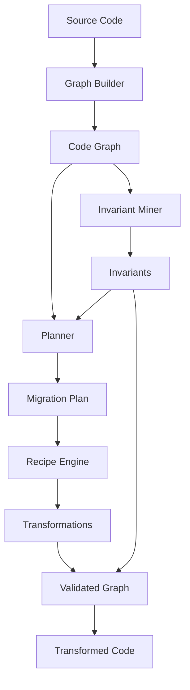

# Architecture

AtlasShift is built on a foundation of graph-based code analysis, planning, and invariant validation.

## Overview

AtlasShift transforms codebases through a multi-stage pipeline:

1. **Graph Building**: Converts source code into a structured graph representation
2. **Invariant Mining**: Discovers structural and semantic invariants
3. **Planning**: Creates a safe migration plan
4. **Validation**: Ensures transformations preserve invariants
5. **Execution**: Applies transformations

## System Architecture



## Core Components

### Graph Builder

Builds a code graph from file nodes, extracting:
- File structure
- Functions and classes
- Import/export relationships
- Call graphs

### Invariant Miner

Discovers invariants such as:
- Structural: file existence, node connectivity
- Dependency: no circular imports, valid references
- Semantic: function usage patterns

### Planner

Creates migration plans by:
- Analyzing transformation dependencies
- Estimating risk levels
- Ensuring invariant preservation

### Recipe Engine

Executes recipes that define:
- Transformation patterns
- Application logic
- Validation rules

## Package Structure

```
packages/
├── core/       # Graph, planner, invariant mining
├── cli/        # Command-line interface
├── server/     # API and job runner
└── shared/     # Types and schemas
```

## Extension Points

- **Recipes**: Define new transformation patterns
- **Invariants**: Add custom validation rules
- **Transformations**: Create reusable transformation functions
